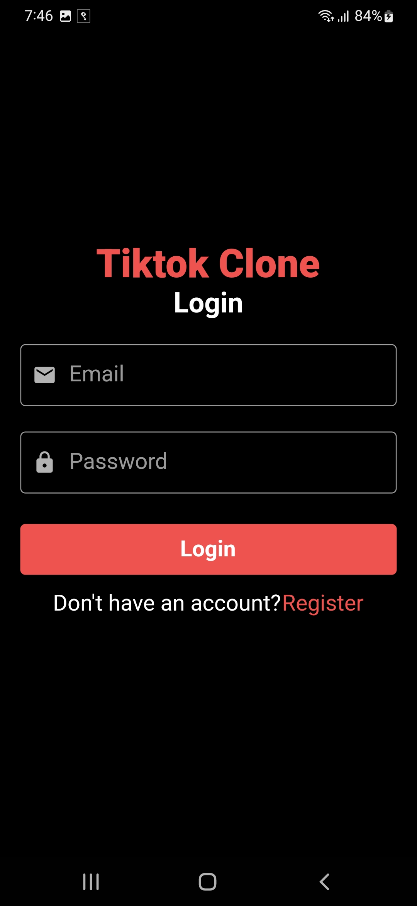
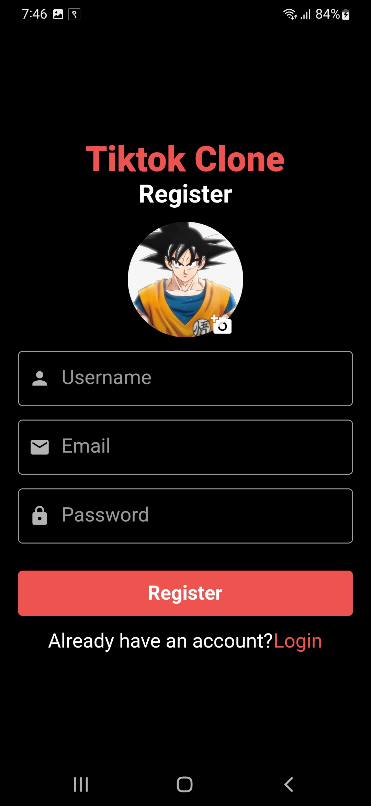

TIKTOK CLONE

Tiktok clone made with flutter and firebase.
Getx is used as state management.

Auth is handled using firebase authentication system

User can post and view videos.

Social media functionality such as likes, comments, and follow is implemented.

